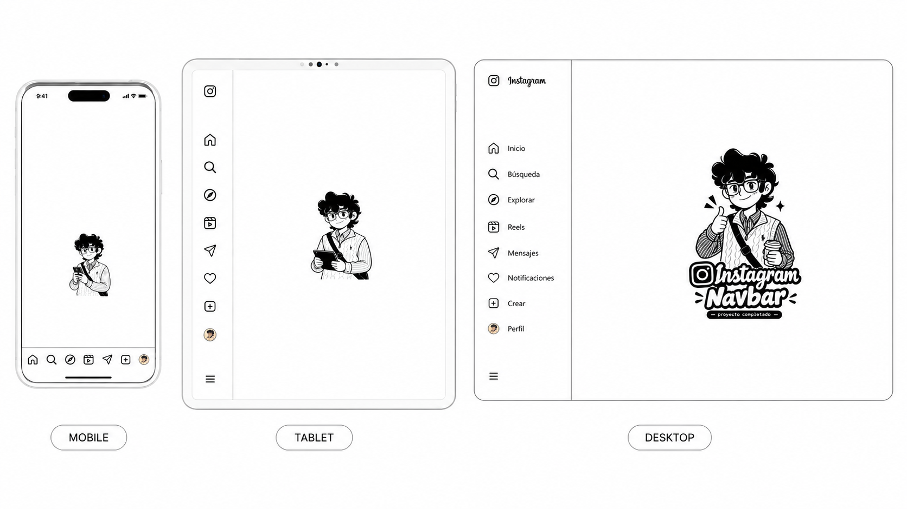
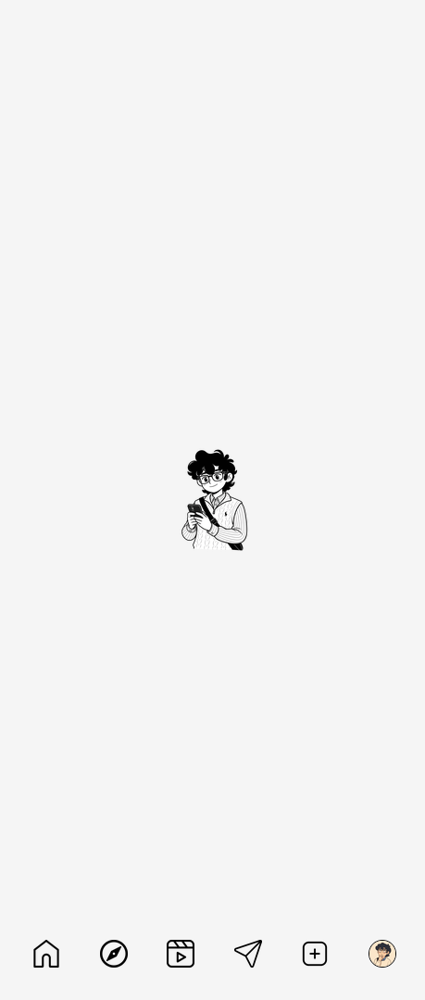
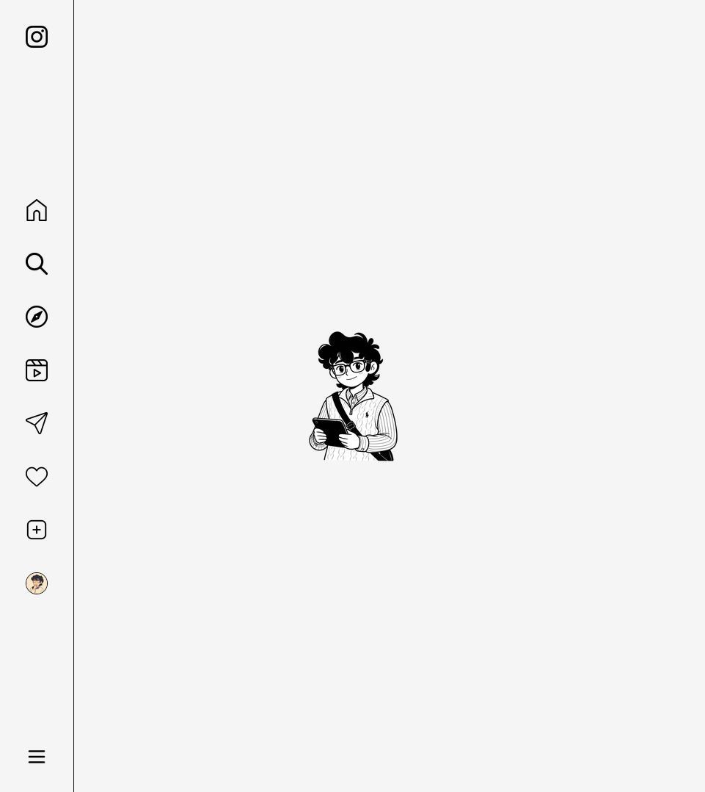
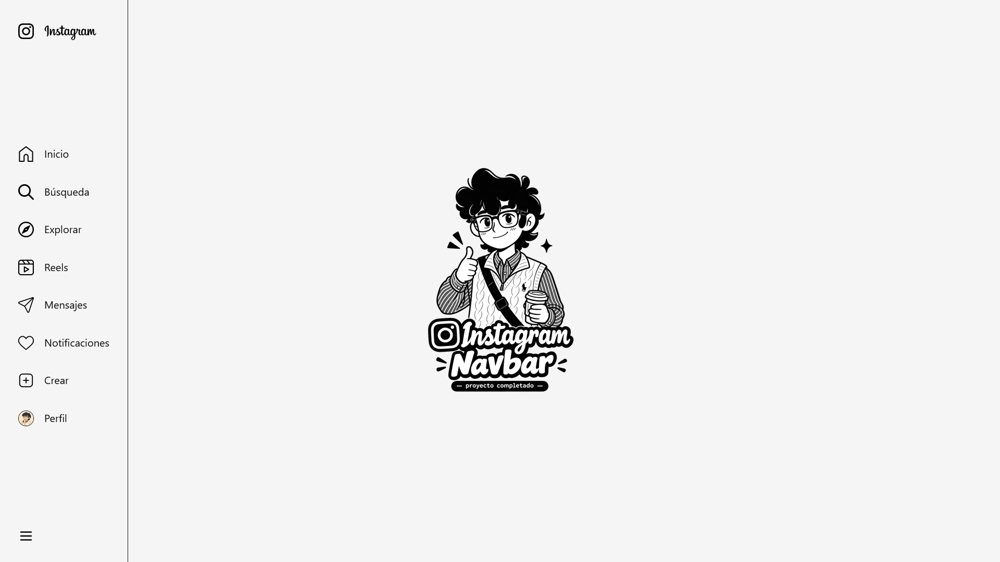

# 📱 Instagram Navbar

<div align="center">

  

  ### Una navbar responsive inspirada en Instagram

  Interfaz frontend construida desde cero para practicar HTML semántico, Flexbox y diseño responsive.

  <p>
    
    
    
  </p>

  <a href="#-preview">Ver preview</a> ·
  <a href="#-ejecución-local">Ejecutar localmente</a> ·
  <a href="#-estructura">Explorar el código</a>

</div>

---

## ✨ Preview

<div align="center">
  
</div>

La interfaz adapta automáticamente su distribución al tamaño de la pantalla:

| Dispositivo | Comportamiento |
| --- | --- |
| 📱 Móvil | Navbar fija en la parte inferior con iconos |
| 💻 Tablet | Navbar vertical lateral con más opciones |
| 🖥️ Escritorio | Navbar lateral completa con logo, iconos y etiquetas |

<div align="center">

  
  
  

</div>

## 🎯 Objetivos

- Practicar una estructura HTML semántica.
- Organizar estilos CSS por responsabilidad.
- Dominar layouts con Flexbox.
- Crear una experiencia responsive con breakpoints claros.
- Incorporar estados hover y focus.
- Experimentar con soporte para dark mode.
- Mejorar el flujo de trabajo con Git.

## 🧰 Tecnologías

- HTML5
- CSS3
- Git

## 💡 Buenas Prácticas

- Flexbox
- Media queries
- `prefers-color-scheme`
- CSS modularizado
- Reglas CSS agrupadas en conjuntos
- Clases con convención BEM

No utiliza JavaScript, frameworks ni dependencias de instalación.

## 📁 Estructura

```text
instagram-navbar/
├── assets/
│   ├── navbar-icons/       # Logos, iconos y foto de perfil
│   ├── previews/           # Capturas de la interfaz
│   └── responsive-images/  # Imágenes para móvil, tablet y escritorio
├── css/
│   ├── main.css            # Layout, responsive, estados y dark mode
│   ├── reset.css           # Reset base
│   └── variables.css       # Variables de diseño y tipografía
├── .gitignore
├── index.html              # Punto de entrada
└── README.md
```

## 🚀 Ejecución local

Como es un proyecto estático, puedes abrir `index.html` directamente en el navegador.

Para una mejor experiencia de desarrollo, inicia un servidor local desde la raíz del proyecto:

```bash
npx serve .
```

También puedes utilizar la extensión **Live Server** de Visual Studio Code.

## ♿ Detalles de accesibilidad

- La navegación está agrupada dentro de un elemento `<nav>`.
- Las imágenes incluyen texto alternativo descriptivo.
- Los enlaces tienen estados visibles de `focus`.
- La interfaz respeta la preferencia de tema del sistema operativo.

## 🛣️ Próximos pasos

- Convertir el botón de menú en un menú funcional.
- Incorporar etiquetas `aria-label` a los controles de solo icono.
- Optimizar la carga de imágenes mediante `<picture>`.

## 📄 Licencia MIT

Este proyecto es de carácter educativo y está creado para practicar fundamentos de desarrollo frontend.

